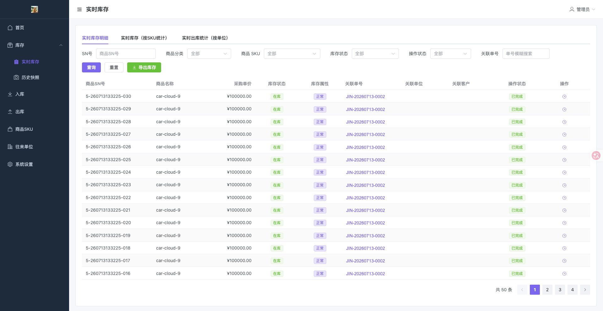
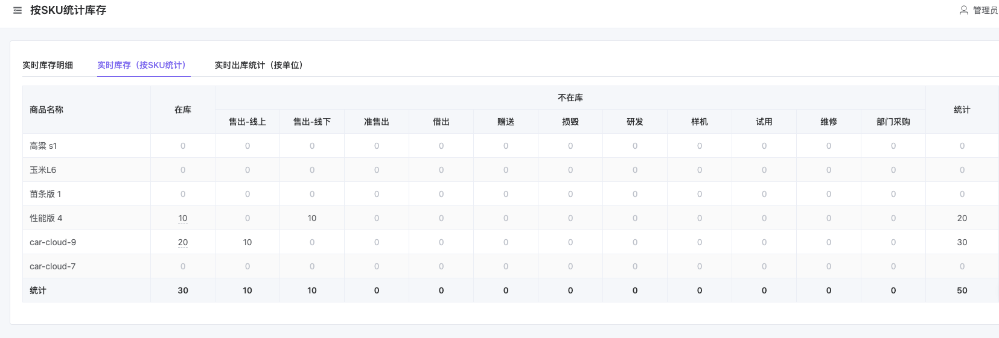
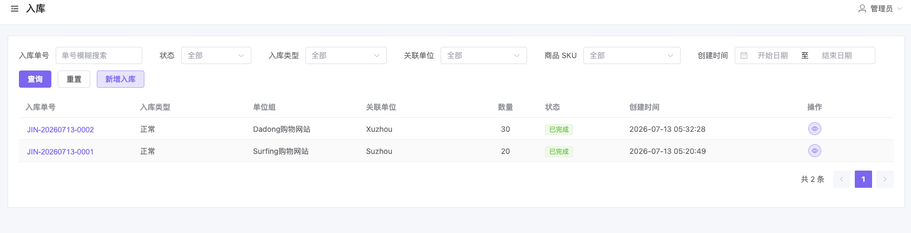
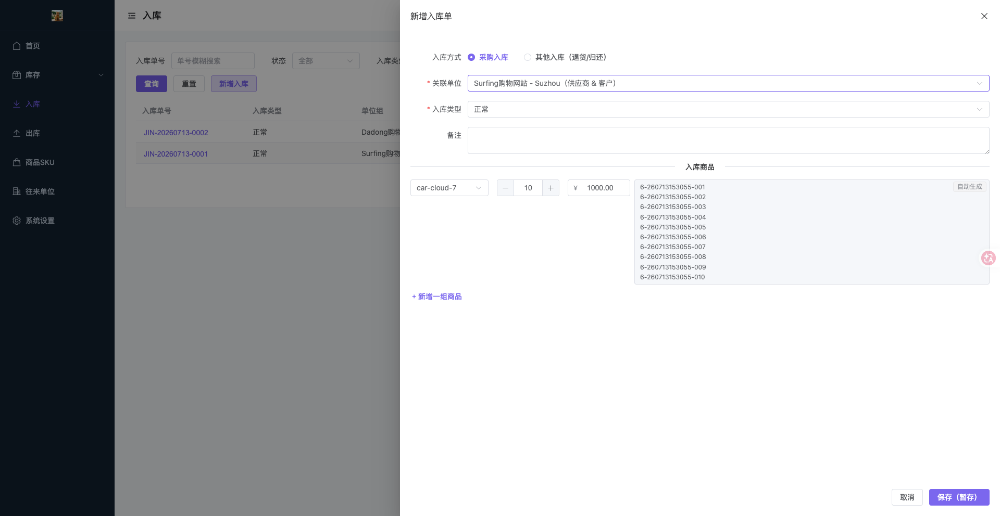
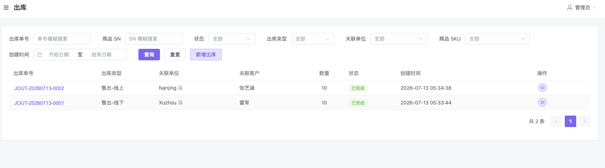
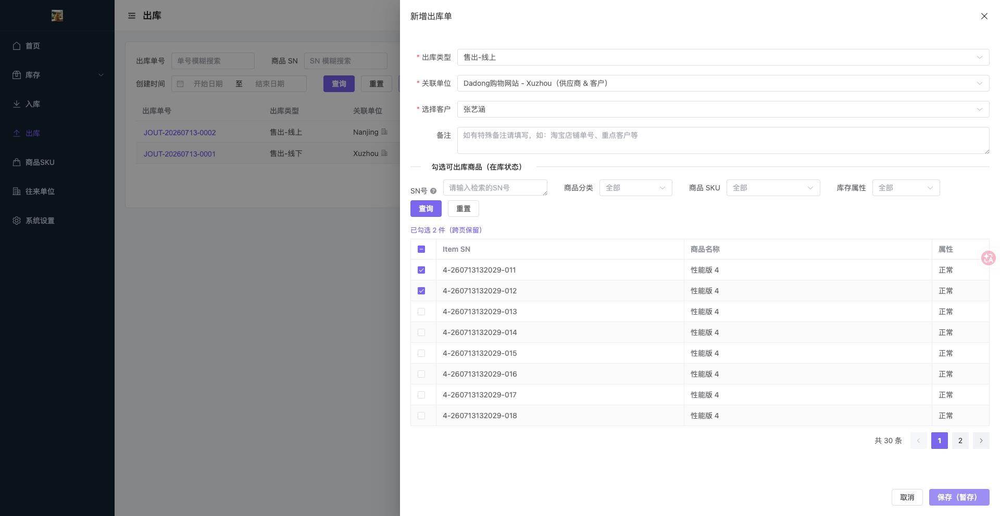
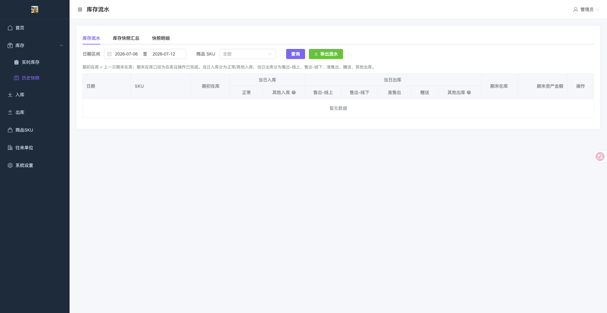
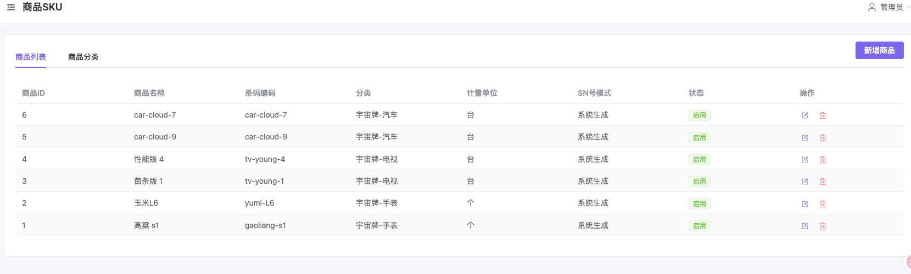
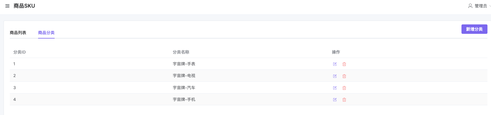
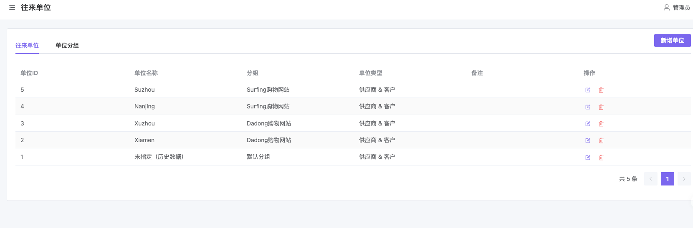

# IMS — 一物一码库存管理系统

> 基于 **FastAPI + Vue 3** 的前后端分离库存管理系统，以「一物一码」为核心理念，每件商品分配唯一 SN 号，全程追踪入库、在库、出库状态。

[](https://www.python.org/)
[](https://fastapi.tiangolo.com/)
[](https://vuejs.org/)
[](https://www.mysql.com/)
[](LICENSE)

## 仓库地址

- Gitee：https://gitee.com/java0904_cloud/ims-opensource
- GitHub：https://github.com/juhedata/ims

---

## 平台简介

IMS 是一套开箱即用、完全开源的库存管理系统，适用于需要精细化单品追踪的场景（电商、制造、零售等）。

- **前端**：Vue 3 + Vite + Element Plus，响应式布局，支持移动端
- **后端**：FastAPI + SQLAlchemy 2.0，自动迁移，JWT 鉴权
- **一物一码**：每件商品生成唯一 SN，支持手动录入或系统自动生成
- **品牌自定义**：管理员可配置项目名称、登录副标题、Logo，开箱即用于自有品牌
- **Docker 一键启动**：三行命令完成全栈部署

---

## 功能模块

| 模块 | 功能说明 |
|------|---------|
| 实时库存 | 按 SN 明细查询在库/出库状态、关联单号、采购单价；支持 SKU/分类/状态多维筛选；一键导出 Excel |
| 库存统计 | 按 SKU 汇总在库数量、各出库类型数量；按单位汇总出库分布 |
| 历史快照 | 每日/月度库存流水，按 SKU 维度查看期初、当日入库、当日出库、期末数据 |
| 入库管理 | 支持采购入库、其他入库（退货/归还）；SN 人工录入或系统自动生成；审核流转 |
| 出库管理 | 支持售出（线上/线下）、借出、赠送、损毁、维修等多种出库类型；按 SN 逐件勾选；关联客户 |
| 商品 SKU | SKU 信息管理（条码、计量单位、SN 生成模式）；商品分类管理 |
| 往来单位 | 供应商/客户/合作方统一管理，支持分组 |
| 系统设置 | 员工账号管理（角色/状态）；品牌配置（名称/副标题/Logo 上传）；操作审计日志 |

---

## 演示截图

**实时库存明细**



**按 SKU 统计库存**



**入库单列表**



**新增入库单**



**出库单列表**



**新增出库单**



**历史快照 / 库存流水**



**商品 SKU 列表**



**商品分类**



**往来单位**



---

## 技术架构

| 层级 | 技术 | 说明 |
|------|------|------|
| Web 框架 | FastAPI | REST API，`DEBUG=true` 时自动生成 Swagger 文档 |
| ORM | SQLAlchemy 2.0 | 声明式模型，`Mapped[]` 类型注解 |
| 数据库 | MySQL 5.7+ | 连接串由 `.env` 配置 |
| 迁移 | Alembic | 版本化变更，支持启动时自动执行 |
| 鉴权 | JWT + bcrypt | Bearer Token，管理员/员工双角色 |
| 定时任务 | APScheduler | 每月 1 日自动快照库存单品 |
| 前端框架 | Vue 3 + Vite | Composition API，按需引入 |
| UI 组件 | Element Plus | 响应式，支持移动端收缩侧栏 |
| 状态管理 | Pinia | 模块化 store |
| HTTP 客户端 | Axios | 统一拦截器，Token 自动注入 |
| 容器化 | Docker + Compose | 三服务一键启动 |

---

## 快速启动（Docker）

**环境要求**：Docker 20.10+、Docker Compose v2

```bash
# 1. 克隆项目
git clone https://gitee.com/java0904_cloud/ims-opensource.git
# 或
git clone https://github.com/juhedata/ims.git
cd ims-opensource   # Gitee 克隆目录名；GitHub 为 ims

# 2. 复制并编辑环境变量（至少修改三处密钥）
cp .env.example .env

# 3. 一键构建并启动
docker compose up -d --build
```

启动完成后访问：

| 服务 | 地址 |
|------|------|
| 前端 | http://localhost:8080 |
| 后端健康检查 | http://localhost:8000/health |
| Swagger 文档 | http://localhost:8000/docs（需 `DEBUG=true`） |

默认管理员账号：`admin` / `admin123`（**生产环境请在 `.env` 中修改 `ADMIN_PASSWORD`**）

登录后进入 **系统设置 → 品牌配置**，可自定义项目名称、登录副标题，并上传 Logo。

**停止服务**

```bash
docker compose down
```

**更新部署**（拉取新代码后）

```bash
git pull
docker compose up -d --build
```

---

## 本地开发

### 环境要求

- Python 3.12+，[uv](https://docs.astral.sh/uv/) 包管理器
- Node.js 20+
- MySQL 5.7+

### 后端

```bash
cd backend
cp .env.example .env   # 编辑数据库与 JWT 配置

uv sync                # 安装依赖
uv run alembic upgrade head          # 执行数据库迁移
uv run python scripts/init_admin.py  # 初始化管理员
uv run uvicorn main:app --reload     # 启动开发服务器（http://localhost:8000）
```

### 前端

```bash
cd frontend
cp .env.example .env   # 按需配置 VITE_API_TARGET

npm install
npm run dev            # 启动开发服务器（http://localhost:5173）
```

---

## 主要环境变量

| 变量 | 默认值 | 说明 |
|------|--------|------|
| `MYSQL_HOST` | — | 数据库主机（必填） |
| `MYSQL_PASSWORD` | — | 数据库密码（必填） |
| `JWT_SECRET_KEY` | — | JWT 签名密钥（必填，生产须随机长串） |
| `ADMIN_PASSWORD` | `admin123` | 首次启动创建的管理员密码 |
| `FRONTEND_PORT` | `8080` | 前端访问端口 |
| `BACKEND_PORT` | `8000` | 后端访问端口 |
| `UPLOAD_DIR` | `uploads` | Logo 等上传文件目录 |
| `CORS_ORIGINS` | `http://localhost:8080` | 跨域白名单，逗号分隔 |

完整说明见 [backend/README.md](backend/README.md)。

---

## 目录结构

```
├── backend/              # FastAPI 后端
│   ├── app/
│   │   ├── api/          # 路由层
│   │   ├── models/       # ORM 模型
│   │   ├── schemas/      # Pydantic 请求/响应
│   │   ├── service/      # 业务逻辑
│   │   └── core/         # 配置、鉴权、日志
│   ├── alembic/          # 数据库迁移
│   ├── scripts/          # 运维脚本
│   └── main.py
├── frontend/             # Vue 3 前端
│   ├── src/
│   │   ├── views/        # 页面
│   │   ├── stores/       # Pinia 状态
│   │   ├── api/          # 接口封装
│   │   └── layout/       # 主布局
│   └── deploy/           # Nginx 配置
├── pic/                  # 演示截图
├── docker-compose.yml
└── .env.example
```

---

## 开源协议

本项目基于 [MIT License](LICENSE) 开源，欢迎 Issue 与 PR。
